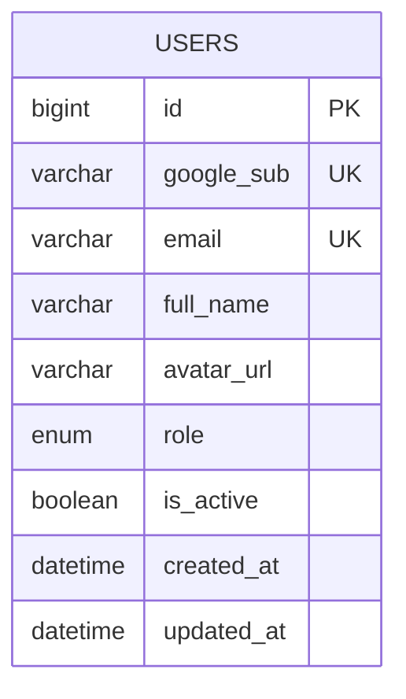
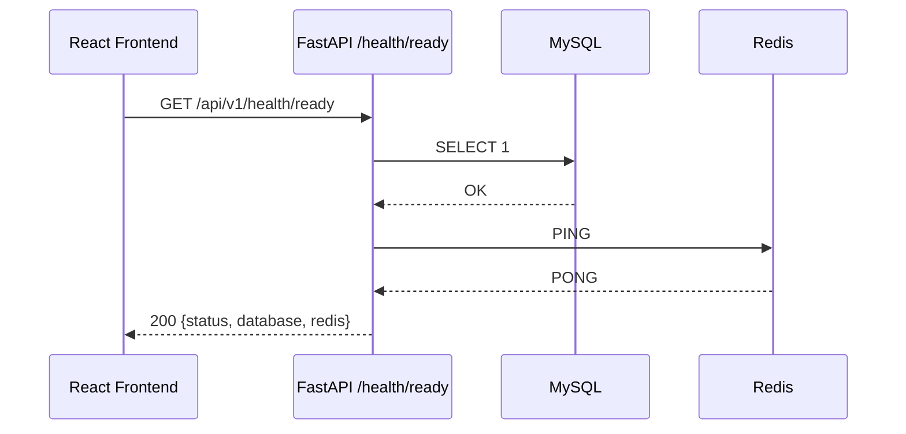
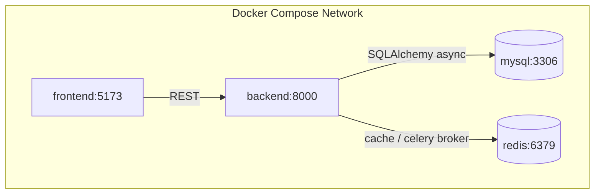

# Vikrm — Architecture (Milestone 1)

## 1. System Overview

Vikrm is a decoupled monorepo: a FastAPI backend exposing a versioned
REST API, and a React SPA frontend, communicating over HTTP/JSON (and
WebSockets from Milestone 3 onward). MySQL is the system of record;
Redis backs caching, Celery task queues, and later real-time pub/sub.
ChromaDB joins in Milestone 6 for vector storage. The full stack runs
under Docker Compose so `docker compose up` reproduces the same
environment anywhere.

**Key decisions:**
- **FastAPI**: native async, Pydantic v2 validation, automatic OpenAPI
  docs, first-class fit with LangChain/LangGraph's async APIs.
- **MySQL**: per project requirement. Vector storage is deliberately
  kept out of MySQL and delegated to ChromaDB as a separate service,
  since MySQL has no native vector type — this keeps the relational
  store focused on relational data.
- **Layered backend** (`api` → `services` → `repositories` → `models`):
  each layer only depends on the one below it, which is what lets new
  milestones add functionality without rewriting existing modules.

## 2. Folder Structure

```
vikrm/
├── backend/
│   ├── app/
│   │   ├── main.py
│   │   ├── core/            # config, logging, database, redis
│   │   ├── models/          # SQLAlchemy ORM models
│   │   ├── repositories/    # data access layer
│   │   ├── services/        # business logic
│   │   ├── schemas/         # Pydantic DTOs
│   │   └── api/v1/          # routers
│   ├── alembic/              # migrations
│   ├── tests/
│   ├── requirements.txt
│   ├── Dockerfile
│   └── .env.example
├── frontend/
│   ├── src/
│   │   ├── main.tsx / App.tsx
│   │   ├── lib/              # api-client, query-client, utils
│   │   ├── store/            # Zustand stores
│   │   ├── pages/
│   │   ├── components/
│   │   ├── hooks/
│   │   └── types/
│   ├── package.json
│   ├── vite.config.ts
│   ├── Dockerfile
│   └── .env.example
├── docs/
│   └── API.md
├── docker-compose.yml
└── README.md
```

## 3. Database Schema

```sql
users
├── id            BIGINT PK AUTO_INCREMENT
├── google_sub    VARCHAR(255) UNIQUE NOT NULL
├── email         VARCHAR(255) UNIQUE NOT NULL
├── full_name     VARCHAR(255)
├── avatar_url    VARCHAR(512)
├── role          ENUM('admin','user') DEFAULT 'user'
├── is_active     BOOLEAN DEFAULT TRUE
├── created_at    DATETIME
└── updated_at    DATETIME
```



The `users` table is built to its final Milestone-2 shape now (Google
OAuth fields only, no password column) to avoid a rework migration
later.

## 4. API Design

See `docs/API.md`. Milestone 1 exposes `/health`, `/health/ready`,
`/version` under `/api/v1`.

## 5. Sequence Diagram — Readiness Check



## 6. Docker Architecture



## 7. Configuration Management

Backend: `pydantic-settings` reads a single typed `Settings` object
from `.env` — no scattered `os.getenv` calls anywhere in the codebase.
Frontend: Vite's `import.meta.env` with `VITE_`-prefixed vars, typed
via `vite-env.d.ts`. Both sides ship a committed `.env.example`.

## 8. Frontend Design System (Milestone 1)

- **Color**: near-black background (`hsl(240 10% 6%)`), glass surfaces
  (`hsl(240 8% 10%)` at 60% opacity + blur), violet→cyan brand gradient
  (`#7C3AED` → `#22D3EE`) rather than a single flat accent, semantic
  success/warning/danger.
- **Type**: Space Grotesk for display/headings, Inter for body,
  JetBrains Mono for status data, versions, and timestamps — a
  technical/automation register rather than a generic sans stack.
- **Signature element**: an animated circuit trace connecting the
  service-status cards, with a pulse that travels the path on each
  poll — a literal, restrained nod to "signal moving through a
  system," tying the visual identity directly to what the product does.

## 10. Milestone 2 Additions — Authentication

**New tables**: `refresh_tokens` (hashed token storage, `jti`-indexed,
FK to `users` with `ondelete=CASCADE`).

**New backend modules**:
- `core/security.py` — HS256 JWT issuance/verification, two token
  types (access carries `role`, refresh carries only `jti`).
- `services/auth_service.py` — Google ID token verification
  (cryptographic, via `google-auth`, not client-trusted), find-or-create
  user, first-user-admin promotion, refresh rotation with reuse
  detection.
- `repositories/user_repository.py`, `repositories/refresh_token_repository.py`.
- `api/deps.py` — `get_current_user`, `require_admin` FastAPI
  dependencies, reused by every protected route from here on.
- `api/v1/auth.py`, `api/v1/users.py`.

**New frontend modules**:
- `store/use-auth-store.ts` — persisted Zustand store for tokens + user.
- `lib/api-client.ts` — axios instance with bearer injection and
  single-flight refresh-on-401 (concurrent 401s share one refresh call).
- `hooks/use-auth.ts`, `pages/login.tsx`, `components/protected-route.tsx`,
  `components/user-menu.tsx`.
- `App.tsx` now uses `react-router-dom` with a `/login` route and a
  protected `/` route.

**Design decisions:**
- Refresh tokens are rotated on every use and stored hashed — a stolen
  DB dump can't forge sessions, and token replay is detectable.
- The access token intentionally does not require a DB round-trip to
  verify signature/expiry, but `get_current_user` still loads the user
  row so a deactivated account is rejected immediately rather than
  waiting for token expiry.
- First user in an empty database becomes admin automatically — no
  manual SQL needed on a fresh deploy, and no hardcoded admin email.

## 12. Milestone 3 Additions — Real-Time AI Chat

**New tables**: `conversations`, `messages` (role enum, cascade delete
from conversation → messages, and from user → conversations).

**New backend modules**:
- `services/llm/base.py` — `LLMProvider` ABC, one method: `stream_chat`.
- `services/llm/ollama_provider.py` — real streaming httpx client
  against Ollama's `/api/chat`, newline-delimited JSON parsing.
- `services/llm/registry.py` — provider name → class mapping; this is
  the single seam later milestones extend for OpenAI/Anthropic/etc.
- `services/chat_service.py` — persists user message before streaming
  starts, persists assistant message incrementally chunk-by-chunk,
  preserves partial content + records error reason on provider failure.
- `repositories/conversation_repository.py`, `repositories/message_repository.py`.
- `api/v1/chat.py` — SSE streaming endpoint via `StreamingResponse`.

**New frontend modules**:
- `lib/sse.ts` — SSE-over-fetch client with the same silent-refresh-on-401
  behavior as the main axios client (axios can't consume streaming bodies incrementally).
- `hooks/use-chat.ts` — conversation CRUD (React Query) + `useChatStream`
  for the live streaming overlay.
- `pages/chat.tsx`, `components/conversation-sidebar.tsx`,
  `components/message-bubble.tsx`, `components/composer.tsx`.
- Docker Compose gains an `ollama` service (local-first by default,
  per the project's core requirement).

**Bugs caught and fixed during development** (documented here
deliberately — this is what the test suite is for):
- `stream_reply` originally queried prior conversation history *after*
  persisting the new user message, which would have silently
  duplicated that message in every prompt sent to the model. Caught by
  a dedicated multi-turn regression test
  (`test_stream_reply_second_turn_has_correct_history_no_duplication`)
  before this ever reached a real conversation.
- Message history was built from `conversation.messages` (an ORM
  relationship), which only works if the caller eager-loaded it —
  a latent `MissingGreenlet` crash waiting for any future caller that
  didn't. Replaced with an explicit repository query.

## 14. Milestone 4 Additions — Agent Management

**New table**: `agents` (identity, behavior fields, model settings,
`status` enum for soft-archival). **Schema change**: `conversations`
gains a nullable `agent_id` FK (`ON DELETE SET NULL` — deleting an
agent doesn't delete conversations that used it, it just detaches them).

**New backend modules**:
- `services/agent_service.py` — `build_system_prompt` (pure function,
  combines instructions/goal/personality) + CRUD orchestration.
- `repositories/agent_repository.py`.
- `api/v1/agents.py` — full CRUD, scoped to the authenticated user.
- `services/chat_service.py` extended: `create_conversation` accepts
  `agent_id` and seeds provider/model/title from the agent;
  `stream_reply` re-fetches the agent on every message (so edits take
  effect immediately) and injects its system prompt + temperature.

**New frontend modules**:
- `hooks/use-agents.ts`, `pages/agents.tsx`, `components/agent-form.tsx`.
- `components/conversation-sidebar.tsx` gains an agent picker for
  "New Chat".

**Design decisions:**
- System prompt is built fresh from three fields at message time
  rather than stored pre-concatenated — editing an agent's
  instructions takes effect on its very next message, no migration or
  backfill needed.
- The agent is re-fetched (not cached on the conversation) on every
  `stream_reply` call for the same reason: a conversation always
  reflects its agent's *current* configuration, not a snapshot from
  when the conversation was created.
- Explicit `provider`/`model` on `POST /conversations` still overrides
  an agent's defaults for that one conversation — an agent sets
  sensible defaults, it doesn't lock the user out of choosing differently.

**Test coverage added**: 7 new tests, including
`test_agent_chat_integration.py`, which wraps the provider to capture
the literal messages array and temperature sent to the (mock) model —
proving agents functionally shape a conversation, not just that they
save to the database correctly.

**Flaky test fixed** (pre-existing, from Milestone 2, discovered while
re-running the full suite this milestone): `test_tampered_token_rejected`
flipped the last base64url character of a JWT to prove tampering is
rejected. For a 256-bit HMAC signature, the last base64url character
encodes some unused padding bits — occasionally flipping it left the
decoded signature bytes unchanged, so the "tampered" token was still
valid and the test intermittently failed to fail. Fixed by tampering a
character in the payload segment instead, which always changes the
decoded content and reliably invalidates the signature. Confirmed
non-flaky with 30 consecutive runs.

## 16. Milestone 5 Additions — Memory System

**New table**: `memories` (SQL metadata: content, type, user/agent
scoping). **New storage layer**: ChromaDB, running embedded
(`PersistentClient`, local volume) rather than as a separate server —
consistent with local-first, avoids a network hop per lookup.

**New backend modules**:
- `services/embeddings/base.py` — `EmbeddingProvider` ABC, mirrors
  `LLMProvider`'s pattern exactly.
- `services/embeddings/sentence_transformer_provider.py` — real
  production implementation, lazy-loaded (importing the module doesn't
  trigger a model download; only calling `.embed()` does).
- `services/embeddings/deterministic_provider.py` — a genuine (not
  mocked) offline embedding function used by the test suite and
  available for fully offline development.
- `services/embeddings/registry.py` — name → provider, same pattern as
  `services/llm/registry.py`.
- `core/vector_store.py` — thin ChromaDB wrapper; always takes
  precomputed vectors (never calls Chroma's own embedding functions),
  keeping embedding logic centralized in `EmbeddingProvider`.
- `services/memory_service.py` — dual-write orchestration (MySQL row +
  ChromaDB vector, same `id`), semantic search, user-scoped filtering.
- `api/v1/memory.py`.
- `services/chat_service.py` extended again: `stream_reply` now also
  searches memory on every turn and injects relevant results as a
  system message, independent of any agent system prompt.

**New frontend modules**:
- `hooks/use-memories.ts`, `pages/memory.tsx` (Memory Viewer: list,
  add, delete, and a real semantic search box wired to
  `POST /memories/search`).

**Design decisions:**
- Dual storage (SQL + vector) rather than ChromaDB alone: the Memory
  Viewer needs ordinary list/paginate/filter, which SQL does far
  better than a vector store; semantic search needs vectors, which SQL
  doesn't do at all. Using the SQL row's own `id` as the Chroma
  document id keeps them trivially in sync without a separate mapping table.
- Memory search runs unconditionally on every chat turn rather than
  being opt-in per conversation — if nothing relevant is found, no
  extra system message is added (verified explicitly by
  `test_no_memories_means_no_extra_system_message`), so it never adds
  noise to a conversation with no stored memories.

## 18. Milestone 6 Additions — RAG Document Processing

**New table**: `documents` (metadata + processing status; chunk text/
vectors live in ChromaDB's `"documents"` collection, a separate
collection from Milestone 5's `"memories"`).

**New backend modules**:
- `services/rag/parsers.py` — real parsers for `.txt`/`.md`/`.pdf`/
  `.docx`/`.csv`, explicit `UnsupportedFileTypeError`/`DocumentParseError`
  rather than silent empty-text failures.
- `services/rag/chunking.py` — sentence-aware chunking with overlap,
  pure function, no I/O, fully unit-tested in isolation.
- `services/rag_service.py` — upload pipeline orchestration (parse →
  chunk → embed → store) and user-scoped chunk search, reusing
  `VectorStore`/`EmbeddingProvider` from Milestone 5 directly (a second
  Chroma collection, same embedding provider abstraction — no new
  vector-store plumbing needed).
- `repositories/document_repository.py`.
- `api/v1/documents.py` — multipart upload with extension allow-list
  and a 20MB size cap enforced explicitly (a clear `413`, not a
  generic connection reset).
- `services/chat_service.py` extended a third time: `stream_reply` now
  also searches document chunks and injects them as a citation-bearing
  system message, independent of both the agent prompt and memory context.

**New frontend modules**:
- `hooks/use-documents.ts`, `pages/documents.tsx` (drag-and-drop
  upload, live processing-status polling, citation search).
- **Route-level code splitting** introduced this milestone: five pages
  now lazy-load via `React.lazy`/`Suspense` rather than shipping in the
  main bundle, after the bundle crossed Vite's 500KB warning threshold.

**Design decisions:**
- Synchronous upload processing (not a background job queue) is a
  deliberate, documented choice — not a shortcut taken without
  awareness of the tradeoff. Celery + Redis are already in the stack
  (per the original requirements) but sit unused until Milestone 7's
  workflow engine actually needs asynchronous execution; introducing a
  job queue for RAG alone now would mean building the same
  infrastructure twice.
- Chunk overlap (150 chars) exists specifically so a fact split across
  a chunk boundary is still retrievable from at least one of the two
  chunks — verified by a dedicated "no content lost across chunks" test.
- Document chunks and memory are injected as **separate** system
  messages (not merged into one) so a UI inspecting message roles later
  could distinguish "what the user told us" from "what's in their files."

**Test coverage added**: 21 new tests across chunking (6), parsing (8,
including a real generated PDF via `fpdf2` and a real generated DOCX
via `python-docx`), the RAG service pipeline (5), and chat integration
(2) — bringing the suite to 54 total, all passing.

## 19. Milestone 7 Additions — Workflow Engine

**New tables**: `workflows` (JSON `definition` column — the exact
node/edge graph shape the React Flow builder edits directly),
`workflow_runs` (JSON `steps` column holding the full per-node
execution timeline; reasonable for the step counts a visual builder
produces without needing a separate steps table yet).

**New backend modules**:
- `services/tools/` — `Tool` ABC, `CalculatorTool` (AST-walk, never
  `eval`), `HttpRequestTool` (SSRF-guarded via hostname resolution +
  private/loopback/link-local rejection), `registry.py` (name → tool,
  same pattern as the LLM/embedding registries).
- `services/workflow/templating.py` — regex-based `{{ref}}`
  substitution, no code execution.
- `services/workflow/conditions.py` — structured comparison
  evaluation, no `eval` on expression strings.
- `services/workflow/engine.py` — `WorkflowEngine`, queue-based DAG
  walk with branch-aware edge traversal and per-node failure isolation.
- `services/workflow_service.py` — CRUD + run persistence, synchronous
  execution (same documented tradeoff as RAG upload processing).
- `repositories/workflow_repository.py`, `api/v1/workflows.py`,
  `api/v1/tools.py`.

**Design decisions:**
- Every place this milestone could have reached for `eval()` — prompt
  templating, condition evaluation, the calculator — deliberately
  doesn't. This is a workflow *automation* platform; its own execution
  primitives are exactly where an arbitrary-code-execution shortcut
  would be most tempting and most dangerous, so each one is built as a
  closed, structured interpreter instead, and each is tested against
  real exploit-shaped inputs, not just happy-path arithmetic.
- The engine takes plain dicts (`definition: dict`), not the Pydantic
  schema, as its execution input — `workflow_service.py` passes
  `workflow.definition` (already validated on the way in via
  `CreateWorkflowRequest`) straight through, keeping the engine
  itself free of any FastAPI/Pydantic dependency.

## 20. Milestone 8 Additions — React Flow Workflow Builder

**New frontend modules**:
- `pages/workflows.tsx` — list/create/delete.
- `pages/workflow-builder.tsx` — the canvas, wrapped in
  `ReactFlowProvider` for `screenToFlowPosition` access.
- `components/workflow/nodes.tsx` — one custom node component per type,
  each showing a live summary of its own config; `condition` nodes
  render two named handles (`"true"`/`"false"`) that map directly onto
  the engine's branch field.
- `components/workflow/node-config-panel.tsx`,
  `components/workflow/node-palette.tsx`,
  `components/workflow/run-panel.tsx`.

**Design decisions:**
- No client-side translation layer between canvas state and the
  persisted definition — `Save` serializes React Flow's own
  `nodes`/`edges` state directly into the `{nodes, edges}` shape
  `POST /workflows` and the engine both expect. Anything the canvas
  can draw, the engine can execute, by construction.
- Chose `@xyflow/react` over the older `reactflow` package specifically
  for React 19 compatibility, consistent with the project's already-set
  React 19 requirement.

## 21. Milestone 9 Additions — Tool Execution Framework

**New table**: `tool_executions` (logs standalone, non-workflow tool
calls only — workflow-triggered calls stay recorded in
`WorkflowRun.steps` to avoid two sources of truth for the same event).

**New backend modules**:
- `services/tools/base.py` extended: `Tool.run` now accepts an
  optional `ToolContext` (`user_id`, `session`) — the seam that lets
  `memory_search`/`document_search` be user-scoped without forcing
  every tool to carry a DB session it doesn't need.
- `services/tools/python_executor.py` — real subprocess isolation
  (`asyncio.create_subprocess_exec`, isolated interpreter mode, hard
  timeout), explicitly scoped as single-tenant-appropriate, not a
  multi-tenant security boundary (documented in the module docstring
  and `docs/API.md`, not left implicit).
- `services/tools/memory_search.py`, `services/tools/document_search.py`
  — thin wrappers around `MemoryService`/`RagService` from Milestones
  5/6, reusing their search logic rather than reimplementing it.
- `services/tool_execution_service.py` — timing + logging wrapper
  around a direct tool call.
- `repositories/tool_execution_repository.py`, `api/v1/tools.py`
  extended with `execute`/`history` endpoints.
- `services/workflow/engine.py` updated to construct and pass
  `ToolContext` for every tool node — `memory_search`/`document_search`
  now work inside workflows, verified by
  `test_memory_search_tool_works_inside_a_real_workflow`.

**New frontend modules**: `pages/tools.tsx`, `hooks/use-tools.ts` — a
playground for direct tool testing. The workflow builder's tool picker
needed zero changes, since it already lists tools generically from `/tools`.

**Design decisions:**
- The Python executor's security posture is the most consequential
  decision in this milestone: real OS-process isolation (not
  in-process `exec()`) with a hard timeout is the *actual* boundary,
  verified directly by a test asserting the child process has a
  different PID — not "the code looks like it should be isolated."
  The explicit, written scope limit (single-tenant only) matters as
  much as the isolation mechanism itself.
- `ToolContext` is optional and additive rather than a breaking change
  to every existing tool — `calculator`/`http_request` simply ignore
  it, keeping stateless tools genuinely stateless.

## 22. Milestone 10 Additions — Multi-Agent Orchestration

**New tables**: `agent_teams` (manager + member agent references),
`agent_team_runs` (JSON `plan` and `steps` columns, same
observability pattern as `WorkflowRun` from Milestone 7).

**New backend modules**:
- `services/orchestration/planning.py` — prompt construction for the
  planning and synthesis phases, and `extract_json_array` (balanced-
  bracket search, not "assume the whole response is JSON").
- `services/orchestration_service.py` — `OrchestrationService.run_team`:
  the three-phase plan → delegate → synthesize pipeline, with a
  documented, visibly-marked fallback when planning fails and
  per-member failure isolation mirroring the workflow engine's.
- `repositories/agent_team_repository.py`, `api/v1/agent_teams.py`.

**New frontend modules**: `pages/teams.tsx`, `components/team-form.tsx`,
`hooks/use-agent-teams.ts`.

**Design decisions:**
- Deliberately distinct from Workflows (Milestone 7) rather than
  reusing the DAG engine: a team's execution path is decided by the
  manager agent at run time, not drawn by a person in advance. Reusing
  the workflow engine here would have meant either faking dynamism on
  top of a fixed graph, or bending the DAG executor to support runtime
  graph mutation — cleaner to build the (much simpler) linear
  plan-then-execute pipeline as its own service.
- Testing this required a purpose-built `FakeLLMProvider` (test-only,
  in `tests/test_orchestration_service.py`) whose responses are keyed
  by prompt content rather than call order, so a single test can
  distinguish "this is the planning call" from "this is Member Agent
  A's subtask" from "this is the synthesis call" and assert on each
  independently — this is what let the failure-isolation and fallback
  tests actually exercise the real branching logic instead of just
  asserting a mocked-out happy path.
- Caught and fixed a genuine test bug during development (not a
  service bug): the synthesis prompt embeds each step's subtask text
  verbatim so the manager can see what was done, which meant an early
  version of the fake provider's trigger-matching accidentally matched
  a member's subtask trigger *inside* the synthesis prompt before
  reaching the synthesis trigger. Fixed by checking the more specific
  "Synthesize" trigger first — a small but real reminder that
  test-fixture logic needs the same scrutiny as production code.

## 23. Milestone 11 Additions — Dashboard & Analytics

**No new tables.** `AnalyticsService` (`services/analytics_service.py`)
is pure read-side aggregation over tables every prior milestone
already owns — a deliberate choice: a separate analytics/event-log
table would need to stay in sync with the real data, and for the
query volumes a single-tenant self-hosted platform sees, direct
`COUNT`/`GROUP BY` queries against the source tables are simpler and
can never drift out of sync with what actually happened.

**New backend modules**: `services/analytics_service.py`,
`schemas/analytics.py`, `api/v1/analytics.py`.

**New frontend modules**: `hooks/use-analytics.ts`,
`components/stat-card.tsx`, `components/run-status-chart.tsx`,
`components/activity-feed.tsx`; `pages/dashboard.tsx` rebuilt from a
Milestone-1-only health page into a full usage dashboard.

**Bug caught during development** (see `docs/API.md` for full detail):
`get_recent_activity`'s ordering relied on `DateTime` columns alone,
which have one-second resolution in both SQLite and MySQL as defined
here — two events in the same second had ambiguous order. Fixed by
adding the autoincrementing `id` as an explicit secondary sort key on
every underlying query. This is a real bug independent of any test
environment, not a testing artifact — worth calling out because it's
exactly the class of bug that's invisible in manual testing (humans
rarely trigger two events within the same second) and only surfaces
under the tighter timing automated tests can exercise.

## 24. Milestone 12 Additions — Admin Panel

**No new tables** — `users.role`/`is_active` have existed since
Milestone 2; this milestone gives them a real management interface.

**New backend modules**: `services/admin_service.py`,
`schemas/admin.py`, `api/v1/admin.py`.

**Design decisions:**
- `AdminService.get_system_stats` is a separate service from
  Milestone 11's `AnalyticsService` rather than the same one with a
  scope toggle — `AnalyticsService` is architecturally always
  user-scoped, and mixing an "admin mode" into it would create a
  branch that could accidentally leak cross-user data if ever
  triggered for a non-admin caller. Two services with two clearly
  different query shapes is safer than one service with a conditional.
- Two self-protection rules live in the service layer, not just the
  UI: an admin cannot deactivate their own account or remove their own
  admin role. Both are about preventing an unrecoverable
  zero-admin state, not just a UX nicety — enforced server-side and
  covered by dedicated tests.

**New frontend modules**: `pages/admin.tsx`, `hooks/use-admin.ts`,
`components/admin-route.tsx` — a client-side guard for UX (the actual
authorization boundary is server-side `require_admin`, unchanged since
Milestone 2). The nav bar's "Admin" tab only renders for admin users.

## 25. Milestone 13 Additions — Deployment, Testing, Optimization

A hardening pass, not new features — applies across every prior
milestone's endpoints simultaneously.

**New backend modules**: `core/security_headers.py`,
`core/rate_limit.py`, `Settings.validate_production_safety()`
(`core/config.py`), both wired into `main.py`'s middleware stack and
startup sequence respectively.

**New deployment artifacts**: `backend/Dockerfile.prod`,
`frontend/Dockerfile.prod`, `frontend/nginx.conf`,
`docker-compose.prod.yml`, `.env.prod.example`,
`.github/workflows/ci.yml`, `DEPLOYMENT.md`, `backend/pyproject.toml`
(ruff config).

**Design decisions:**
- The rate limiter fails **open** on a Redis outage, not closed — a
  deliberate choice verified by a dedicated test
  (`test_rate_limiter_fails_open_when_redis_unreachable`), since a
  protective mechanism that turns a Redis blip into a total API outage
  is a worse failure mode than temporarily having no rate limiting.
- The production-safety startup check
  (`validate_production_safety`) exists because a default JWT secret
  in production is not a theoretical risk — it means anyone can forge
  valid session tokens — and "fail loudly at boot" is strictly better
  than "silently run vulnerable," which is what would happen without
  this check.
- Production and development Docker configs are kept as fully separate
  files (`Dockerfile` vs `Dockerfile.prod`,
  `docker-compose.yml` vs `docker-compose.prod.yml`) rather than one
  parameterized file with build args — the differences (non-root user,
  multi-stage build, no bind mounts, Nginx vs Vite dev server) are
  substantial enough that a single conditional file would be harder to
  read and easier to misconfigure than two clear, separate ones.
- CI's `ruff` step was run locally against the actual codebase before
  being added to the workflow — it surfaced two genuine unused imports
  (fixed) and two SQLAlchemy-forward-reference false positives (fixed
  properly via `TYPE_CHECKING` imports, not suppressed) — so the CI
  config reflects a lint pass that's already known to succeed, not one
  assumed to.

**Honest limitation**: this sandbox has no Docker daemon (confirmed in
Milestone 1), so `Dockerfile.prod`/`docker-compose.prod.yml` were
never actually built or run here. `docker-compose.prod.yml` is
verified as valid YAML with the expected services; the Dockerfiles
follow standard, well-established multi-stage patterns but a real
build on a Docker-enabled host is the natural next step before an
actual production deploy — the same class of limitation already
disclosed for Ollama in Milestone 3.

**Test coverage added**: 9 new tests, bringing the suite to **138
tests total** across all 13 milestones.

## 26. Future Extensibility

- Repository/Service split lets every future milestone (multi-agent
  orchestration, dashboard/analytics, admin panel) add
  `services/*.py` + `repositories/*.py` pairs without touching earlier
  milestones' code.
- Alembic from day one means every schema change is a reviewable
  migration.
- `api/v1` versioning allows a future `v2` without breaking existing
  clients.
- Celery + Redis are wired into `docker-compose.yml` and ready for
  Milestone 9+ if/when workflow execution needs to move to a
  background queue for long-running steps.
