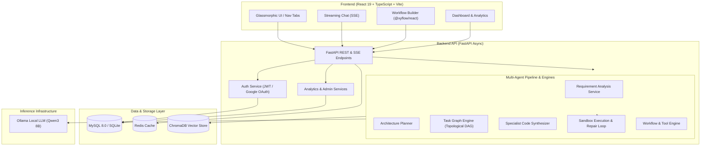

# Vikrm AI Platform

**A local-first, privacy-preserving multi-agent platform for autonomous code synthesis, dependency-graph task execution, and sandboxed runtime validation.**

[](https://mit-license.org)
[](https://www.python.org)
[](https://fastapi.tiangolo.com)
[](https://reactjs.org)
[](https://www.typescriptlang.org)
[](https://www.sqlalchemy.org)
[](https://www.trychroma.com)

---

## ⏱️ 30-Second Summary

**Vikrm AI Platform** is a full-stack open-source application designed to transform high-level natural language software requirements into complete, validated multi-file codebases. Built to operate entirely locally, Vikrm leverages local open LLMs (such as Qwen3 8B via Ollama) to eliminate third-party API dependencies and keep all code and prompt data completely private.

Rather than relying on generic text completion or static code templates, Vikrm uses a multi-agent generation pipeline: it breaks user prompts into structured specs, constructs a dependency-aware task graph (DAG) to sequence file generation, streams code in topological order, and validates the output inside an isolated execution sandbox with automated self-repair loops.

---

## ✨ Key Features

- 🏠 **Local-First LLM Architecture**: Runs 100% locally via Ollama (default model `qwen3:8b`) with real-time SSE token streaming and hybrid-reasoning token filtering (`<think>` tag stripping).
- 🧩 **Multi-Agent Code Synthesis Pipeline**: Autonomous requirement extraction, architectural decision planning, and specialist code synthesis across frontend, backend, database, and DevOps layers.
- 📐 **Topological Task Graph Engine**: Dependency-aware DAG task planner with Kahn's algorithm topological sorting and DFS cycle detection to ensure files are generated in proper sequence.
- 🧪 **Sandboxed Subprocess Validation & Self-Repair**: Executes generated code in isolated subprocesses (capturing stdout, stderr, and exit codes) and feeds diagnostic tracebacks back into an automated repair loop.
- 📚 **RAG Vault & Semantic Memory System**: Retrieval-Augmented Generation using ChromaDB vector store and `sentence-transformers` (`all-MiniLM-L6-v2`) for document parsing (PDF, DOCX, TXT, CSV, MD) and persistent conversation memory.
- 🔀 **Visual Workflow Builder & Tool Execution**: Drag-and-drop node graph canvas powered by `@xyflow/react` backed by a server-side execution engine supporting AST-walk math evaluation, SSRF-guarded HTTP requests, and Python tool execution.
- ⚡ **Async FastAPI & React 19 Application Stack**: Decoupled async architecture (FastAPI, SQLAlchemy 2.0 async, Alembic, Redis) paired with a responsive glassmorphic React 19 + TypeScript frontend.
- 🔐 **Security & Multi-Tier Authentication**: JWT access/refresh token rotation with cryptographic reuse detection, Google OAuth 2.0 integration, email verification flows, rate limiting, and role-based access control (Admin / User).

---

## 📐 System Architecture



---

## 💻 Tech Stack

### Backend & AI Infrastructure
| Technology | Version | Purpose |
| :--- | :--- | :--- |
| **Python** | `3.11+` | Core backend runtime |
| **FastAPI** | `0.115.6` | Async REST API framework & SSE streaming |
| **SQLAlchemy** | `2.0.36` | Async ORM & database interaction layer |
| **Alembic** | `1.14.0` | Relational database schema migrations |
| **MySQL / PyMySQL** | `8.0+ / 1.1.1` | Primary relational store (with SQLite fallback) |
| **Redis** | `5.2.1` | Caching and session rate limiting |
| **ChromaDB** | `0.5.23` | Embedded vector database for RAG & memory |
| **Sentence-Transformers**| `3.3.1` | Local vector embedding generation (`all-MiniLM-L6-v2`) |
| **Ollama / HTTPX** | `0.28.1` | Local LLM inference provider & async HTTP client |
| **pytest / pytest-asyncio**| `8.3.4 / 0.25.0` | Automated async backend test suite |

### Frontend Application
| Technology | Version | Purpose |
| :--- | :--- | :--- |
| **React** | `19.0.0` | UI component library |
| **TypeScript** | `5.7.2` | Static type safety |
| **Vite** | `6.0.7` | Frontend build tool and dev server |
| **Tailwind CSS** | `3.4.17` | Utility-first CSS & glassmorphic styling system |
| **Framer Motion** | `11.15.0` | UI animations and transition effects |
| **@xyflow/react** | `12.3.6` | Interactive visual workflow graph builder |
| **Zustand** | `5.0.2` | Lightweight global client state management |
| **TanStack React Query** | `5.62.11` | Server state management and API caching |
| **Monaco Editor** | `4.7.0` | Code editing and preview interface |

---

## 🔍 What Makes This Technically Interesting

### 1. Local-First Inference & Hybrid-Reasoning Token Parsing
Running software synthesis entirely on local models eliminates external cloud costs and guarantees privacy. However, modern reasoning LLMs (such as Qwen3) emit raw internal `<think>...</think>` thought chains during token streaming. Vikrm implements real-time regex-based streaming filtering in its LLM provider layer (`app/services/llm/base.py` & `ollama_provider.py`) to strip chain-of-thought tokens on the fly, delivering clean, immediate code completions to the user interface.

### 2. Dependency-Graph-Driven Batch Code Generation
Rather than generating codebase files in random order or relying on hardcoded static templates, Vikrm treats software construction as a Directed Acyclic Graph (DAG) problem. The `TaskGraphBuilder` (`app/services/project/task_graph_builder.py`) and `DependencyGraphResolver` (`app/services/project/dependency_graph.py`) apply Kahn's algorithm and DFS cycle detection to organize generation into strict topological tiers. Foundation files (`package.json`, `tsconfig.json`) are synthesized and validated first, followed by database models, API client layers, component logic, application roots, and deployment configuration.

### 3. Sandboxed Subprocess Execution & Automated Self-Repair
To verify that synthesized code works beyond surface-level syntax, Vikrm includes an isolated sandbox validation layer (`app/services/sandbox_execution_service.py` & `validation_service.py`). Synthesized scripts are executed in dedicated OS subprocesses with explicit execution timeouts, capturing exit codes, `stdout`, and `stderr`. If a syntax error or missing import occurs, the `SelfRepairLoop` (`app/services/project/self_repair_loop.py`) feeds the captured traceback back into the specialist synthesis agent for automated surgical correction.

### 4. AST-Based Expression Evaluation & SSRF-Guarded Execution
Security is enforced at the execution layer. The visual workflow and tool engine (`app/services/workflow/engine.py` & `app/services/tools/`) deliberately avoids unsafe `eval()` calls for template rendering or condition evaluation. Mathematical expressions are parsed via Abstract Syntax Tree (AST) traversal (`calculator.py`), conditional branches are evaluated through structured comparative operations (`conditions.py`), and outgoing HTTP requests (`http_request.py`) are guarded against Server-Side Request Forgery (SSRF) via strict private and loopback IP resolution checks.

---

## 📸 Screenshots & Demo

> [!NOTE]
> *UI screenshots will be embedded here upon launching the application in a live browser environment.*

- **Dashboard & System Health**: Telemetry, active agent counts, and recent activity monitoring.
- **Streaming Multi-Agent Chat**: Real-time code generation with reasoning visibility.
- **Visual Workflow Builder**: Interactive DAG graph canvas powered by `@xyflow/react`.
- **RAG Document Vault & Memory Viewer**: Document uploads and semantic vector search.

---

## 🚀 Getting Started

### Prerequisites
- **Python**: v3.11 or higher
- **Node.js**: v18.0.0 or higher
- **MySQL**: v8.0+ (or SQLite for zero-dependency local testing)
- **Redis**: v5.0+ (for caching and rate limiting)
- **Ollama**: (Optional for local LLM execution; pull model with `ollama pull qwen3:8b`)

---

### Environment Setup

#### 1. Backend Configuration (`backend/.env`)
```env
APP_NAME=Vikrm
ENVIRONMENT=development
HOST=0.0.0.0
PORT=8000

# Database (MySQL or SQLite)
USE_SQLITE=true
MYSQL_HOST=localhost
MYSQL_PORT=3306
MYSQL_USER=vikrm
MYSQL_PASSWORD=vikrm_password
MYSQL_DATABASE=vikrm

# Redis & Security
REDIS_HOST=localhost
REDIS_PORT=6379
JWT_SECRET_KEY=your-secure-random-jwt-secret-key

# LLM & RAG Configuration
OLLAMA_BASE_URL=http://localhost:11434
DEFAULT_LLM_PROVIDER=ollama
DEFAULT_LLM_MODEL=qwen3:8b
EMBEDDING_PROVIDER=sentence-transformers
EMBEDDING_MODEL=all-MiniLM-L6-v2
```

#### 2. Frontend Configuration (`frontend/.env`)
```env
VITE_API_BASE_URL=http://localhost:8000/api/v1
VITE_GOOGLE_CLIENT_ID=your-google-client-id.apps.googleusercontent.com
```

---

### Local Installation & Execution

#### Step 1: Start Backend API
```bash
cd backend

# Create & activate virtual environment
python -m venv venv
# On Windows:
.\venv\Scripts\activate
# On Linux/macOS:
# source venv/bin/activate

# Install backend dependencies
pip install -r requirements.txt

# Run database migrations
python -m alembic upgrade head

# Launch FastAPI application server
python -m uvicorn app.main:app --reload --port 8000
```
*API interactive documentation is accessible at `http://localhost:8000/docs`.*

#### Step 2: Start Frontend Application
```bash
cd frontend

# Install Node dependencies
npm install

# Start Vite development server
npm run dev
```
*The web interface will open at `http://localhost:5173`.*

---

## 🧪 Testing & Verification

The repository includes a backend unit and integration test suite covering API endpoints, security middleware, multi-agent orchestration, RAG pipelines, workflow graph execution, and sandbox validation.

To run the backend test suite:

```bash
cd backend
# Set VIKRM_TEST_MODE flag and execute pytest
VIKRM_TEST_MODE=1 python -m pytest -q
```

**Verified Test Suite Output**:
```text
142 passed, 2 warnings in 92.48s
```
*(100% pass rate across all 142 backend tests).*

To run frontend type checking and production build verification:

```bash
cd frontend
npm run build
```

---

## 📌 Project Status & Roadmap

- [x] **Core Multi-Agent Generation Engine**: Requirement extraction, DAG planning, and topological code synthesis.
- [x] **Sandboxed Subprocess Validation**: Execution monitoring and self-repair loop.
- [x] **Document RAG & Semantic Memory**: ChromaDB vector integration for user files and memories.
- [x] **Visual Workflow Builder**: `@xyflow/react` graph canvas with AST tool execution.
- [x] **Enterprise Security**: JWT token pair rotation, rate limiting, and security header middleware.
- [ ] **Asynchronous Background Worker Queue**: Migrating synchronous RAG uploads to background Celery tasks.
- [ ] **WebSocket Live Graph Telemetry**: Replacing SSE polling with bi-directional WebSockets for live node execution status.

---

## 📄 License & Author Context

- **License**: [MIT License](LICENSE)
- **Project Role / Author Note**: *Developed by [Your Name]. Primary contributions include designing the topological task graph resolver, building the hybrid-reasoning token filter for Ollama integration, implementing the sandboxed self-repair execution loop, and building the React 19 workflow canvas.*
