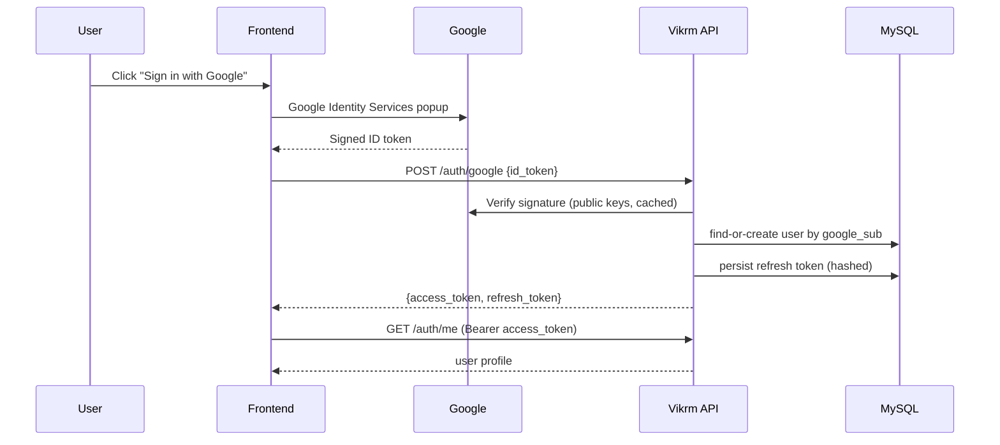
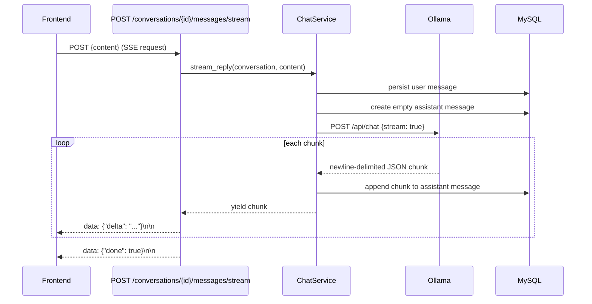
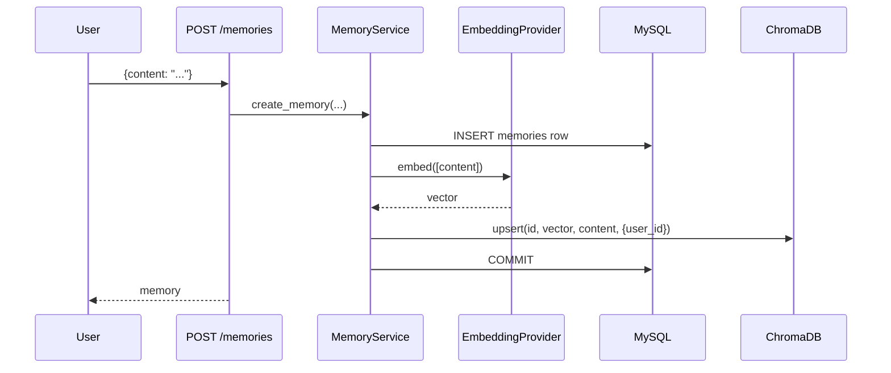
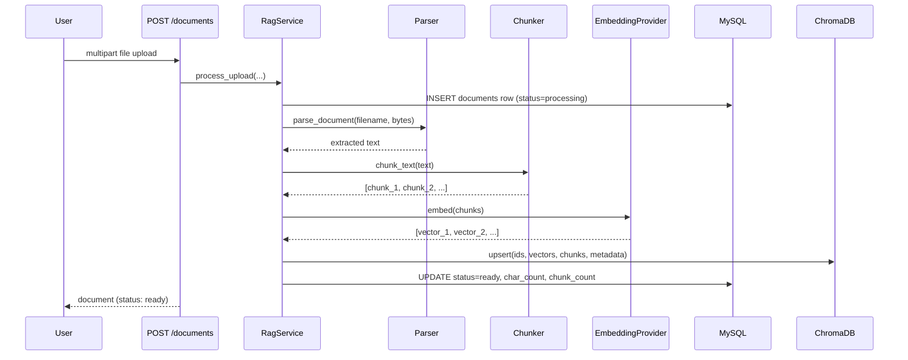
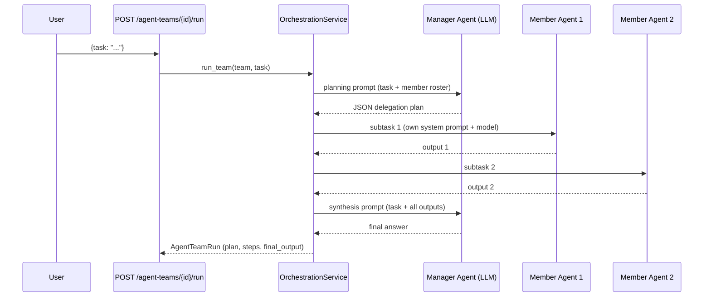

# Vikrm API Documentation — Milestone 1

Base URL (local dev): `http://localhost:8000/api/v1`

Interactive docs are also auto-generated by FastAPI and available at:
- Swagger UI: `http://localhost:8000/api/docs`
- ReDoc: `http://localhost:8000/api/redoc`
- OpenAPI schema (JSON): `http://localhost:8000/api/openapi.json`

---

## `GET /health`

Liveness probe. Returns 200 as long as the FastAPI process is running —
does not check downstream dependencies. Use this for container
orchestration liveness checks.

**Response `200`**
```json
{
  "status": "ok",
  "app_name": "Vikrm",
  "version": "0.1.0"
}
```

---

## `GET /health/ready`

Readiness probe. Actively checks MySQL (`SELECT 1`) and Redis (`PING`).
Use this for orchestration readiness checks and for the frontend
dashboard's live status cards.

**Response `200`**
```json
{
  "status": "ready",
  "database": "up",
  "redis": "up"
}
```

If either dependency is unreachable, `status` becomes `"degraded"` and
the corresponding field becomes `"down"`. The endpoint still returns
HTTP 200 in this case — degradation is communicated in the payload, not
via HTTP status, since the API process itself is still healthy.

---

## `GET /version`

Returns build/deployment metadata.

**Response `200`**
```json
{
  "app_name": "Vikrm",
  "version": "0.1.0",
  "environment": "development"
}
```

---

## Error Format

Not yet applicable — Milestone 1 has no endpoints that can fail on
business logic. A consistent error envelope will be introduced in
Milestone 2 alongside authentication (`401`/`403` responses) and
documented there.

---

# Milestone 2 — Authentication

## Setup: Google OAuth Client

1. Go to the [Google Cloud Console](https://console.cloud.google.com/apis/credentials).
2. Create an **OAuth 2.0 Client ID** of type "Web application".
3. Add `http://localhost:5173` to **Authorized JavaScript origins**.
4. Copy the Client ID into both:
   - `backend/.env` → `GOOGLE_CLIENT_ID`
   - `frontend/.env` → `VITE_GOOGLE_CLIENT_ID`
   (Same value in both — the frontend uses it to render the Google
   Sign-In button; the backend uses it to verify the token's audience.)

## Auth Flow

1. Frontend renders Google's official Sign-In button (`@react-oauth/google`).
2. On success, Google returns a signed **ID token** to the browser —
   Vikrm's frontend never sees the user's Google password.
3. Frontend sends that ID token to `POST /auth/google`.
4. Backend verifies the token's signature, audience, and issuer against
   Google's public keys (via `google-auth`), finds-or-creates the user
   by `google_sub`, and issues a Vikrm-signed **access token** (30 min)
   + **refresh token** (7 days).
5. Frontend stores both tokens and attaches the access token as
   `Authorization: Bearer <token>` on every subsequent request.
6. On a `401`, the frontend automatically calls `POST /auth/refresh`
   once, retries the original request, and only logs the user out if
   the refresh itself fails.



## Endpoints

### `POST /auth/google`

**Request**
```json
{ "id_token": "eyJhbGciOi..." }
```

**Response `200`**
```json
{
  "access_token": "eyJ...",
  "refresh_token": "eyJ...",
  "token_type": "bearer"
}
```

**`401`** — invalid/expired Google token, unverified email, or missing
server-side `GOOGLE_CLIENT_ID` configuration.

---

### `POST /auth/refresh`

Rotates a refresh token: the presented token is immediately revoked and
a new pair is issued. Reusing an already-rotated token revokes **all**
active sessions for that user (reuse is treated as a compromise signal).

**Request**
```json
{ "refresh_token": "eyJ..." }
```

**Response `200`** — same shape as `/auth/google`.

**`401`** — expired, revoked, reused, or malformed token.

---

### `GET /auth/me`

Requires `Authorization: Bearer <access_token>`.

**Response `200`**
```json
{
  "id": 1,
  "email": "jane@example.com",
  "full_name": "Jane Doe",
  "avatar_url": "https://lh3.googleusercontent.com/...",
  "role": "user",
  "is_active": true
}
```

**`401`** — missing, invalid, or expired access token, or the user is
no longer active.

---

### `POST /auth/logout`

Requires `Authorization: Bearer <access_token>`. Revokes the specific
refresh token supplied (i.e. logs out the current session/device only).

**Request**
```json
{ "refresh_token": "eyJ..." }
```

**Response**: `204 No Content`

---

### `GET /users` — RBAC-protected

Requires an **admin** access token. Non-admins receive `403`.

**Response `200`**
```json
[
  {
    "id": 1,
    "email": "jane@example.com",
    "full_name": "Jane Doe",
    "avatar_url": "https://...",
    "role": "admin",
    "is_active": true
  }
]
```

## Security Notes

- The `users` table has no password column — Google is the sole
  identity provider, by design.
- The **first user ever created** is automatically promoted to `admin`
  so a fresh deployment always has at least one admin without manual
  DB edits. Every subsequent sign-in defaults to `user`.
- Refresh tokens are stored **hashed** (SHA-256) in `refresh_tokens`,
  never in plaintext — a DB leak alone can't be used to forge sessions.
- Refresh tokens **rotate** on every use; reuse of a rotated-out token
  revokes all of that user's sessions.

---

# Milestone 3 — Real-Time AI Chat (Ollama, Streaming)

## Setup: Ollama

Docker Compose now includes an `ollama` service. After `docker compose up`,
pull a model into it once:

```bash
docker compose exec ollama ollama pull qwen3:8b
```

Any model tag Ollama supports works — update `DEFAULT_LLM_MODEL` in
`backend/.env` (or pass `model` when creating a conversation) to switch.

## Provider Architecture

`LLMProvider` (`app/services/llm/base.py`) is the interface every model
provider implements — one async generator method, `stream_chat`, that
yields text chunks. `OllamaProvider` is the first implementation;
`app/services/llm/registry.py` maps a provider name string to its class.
Adding OpenAI/Anthropic/Gemini/Groq in a later milestone means one new
file + one registry line — `ChatService` and every API route are
already provider-agnostic and require no changes.

## Streaming Architecture



Key properties:
- The user's message is persisted **before** any streaming begins, so
  it survives even if the provider call fails entirely.
- The assistant message is persisted **incrementally**, chunk by
  chunk — a dropped connection mid-stream leaves a partial (not empty,
  not lost) response in the database.
- If the provider errors mid-stream, the partial content is preserved
  and `messages.error` records the failure reason; the frontend renders
  this inline rather than showing a silently truncated message.
- Response format is Server-Sent Events (`text/event-stream`), each
  event a JSON object: `{"delta": "text"}`, `{"error": "reason"}`, or
  `{"done": true}`.

## Endpoints

### `GET /conversations`
List the current user's conversations, most recently updated first.

### `POST /conversations`
**Request** (all fields optional): `{ "title": "...", "provider": "ollama", "model": "qwen3:8b" }`

### `GET /conversations/{id}`
Returns the conversation with full message history.

### `DELETE /conversations/{id}`
Deletes a conversation and all its messages (cascade).

### `POST /conversations/{id}/messages/stream`
**Request**: `{ "content": "user's message" }`
**Response**: `text/event-stream` — see Streaming Architecture above.

### `GET /providers`
Returns `{ "providers": ["ollama"] }` — used by the frontend model picker.

## Frontend Notes

- `lib/sse.ts` implements SSE consumption over raw `fetch` (axios
  doesn't support incremental `ReadableStream` reads), including the
  same silent-refresh-on-401 behavior as the main axios client.
- `hooks/use-chat.ts`'s `useChatStream` overlays an in-flight
  user+assistant message pair on top of the confirmed history from
  `useConversation` while streaming, then invalidates that query on
  completion to reconcile with what the server actually persisted.

## What's Verified vs. What Needs a Real Ollama

Verified end-to-end in this environment (no live Ollama available in
the build sandbox): the HTTP streaming parser, the full `ChatService`
persistence flow, multi-turn history construction, and error handling
— all tested against a mock server that speaks Ollama's exact
newline-delimited-JSON protocol (see `tests/test_ollama_provider.py`,
`tests/test_chat_service.py`). Not independently verified here: an
actual Ollama installation returning real model output — that requires
running `docker compose up` with Ollama on your machine, per the setup
steps above.

---

# Milestone 4 — Agent Management

## What an Agent Is

A saved, reusable AI configuration: identity (name, description,
color), behavior (instructions/goal/personality — combined into a
system prompt at conversation time), and model settings
(provider/model/temperature/max_tokens). Agents are private to the
user who created them; a Marketplace/sharing feature is a later
milestone and will add a `visibility` column rather than reworking
this schema.

## How Agents Affect Conversations

Starting a conversation from an agent (`POST /conversations` with
`agent_id`) seeds the conversation's `provider`/`model`/`title` from
that agent. Every message streamed in that conversation:
1. Fetches the agent fresh (so editing an agent's instructions affects
   its next message immediately, without needing to recreate the conversation).
2. Prepends a `system` message built from `instructions` + `goal` +
   `personality` (skipped if the conversation already starts with an
   explicit system message).
3. Uses the agent's `temperature` for the provider call.

This is proven by `tests/test_agent_chat_integration.py`, which
captures the exact messages and temperature the (mock) provider
receives — not just that `ChatService` claims to send them.

## Endpoints

### `GET /agents?include_archived=false`
List the current user's agents.

### `POST /agents`
**Request**
```json
{
  "name": "Research Assistant",
  "description": "Finds and summarizes information with citations",
  "instructions": "You are a meticulous research assistant.",
  "goal": "Always cite sources.",
  "personality": "Formal and precise.",
  "provider": "ollama",
  "model": "qwen3:8b",
  "temperature": 0.3,
  "max_tokens": 2048,
  "avatar_color": "#7C3AED"
}
```
Only `name` is required; every other field has a sensible default.

### `GET /agents/{id}` / `PATCH /agents/{id}` / `DELETE /agents/{id}`
Standard CRUD, all scoped to the authenticated user — a `404` (not a
`403`) is returned for another user's agent, so existence isn't leaked.

### `POST /conversations` (extended)
Now accepts an optional `agent_id`. If provided, the conversation is
seeded from that agent; passing `provider`/`model` explicitly alongside
`agent_id` still overrides the agent's defaults for that one conversation.

## Cross-User Access Control

Agent lookups are always scoped to `(agent_id, user_id)`, never `agent_id`
alone — starting a conversation with another user's agent ID returns a
`404`, the same as a nonexistent one, so existence isn't leaked either.
Verified by `test_agent_belonging_to_another_user_cannot_be_used`.

---

# Milestone 5 — Memory System

## Architecture

Every memory has two homes: a MySQL row (`memories` table — canonical
metadata, what the Memory Viewer UI lists/paginates) and a ChromaDB
vector (the embedding, used for semantic search). The SQL row's `id`
is the ChromaDB document id, keeping the two in sync.



## Embedding Provider Abstraction

Mirrors `LLMProvider` from Milestone 3: `EmbeddingProvider` is a
one-method interface (`embed`), with `SentenceTransformerProvider` as
the real production implementation (`all-MiniLM-L6-v2`, 384
dimensions). It downloads model weights from Hugging Face on first
use — this requires the backend container to have outbound network
access the first time embeddings are generated; after that, the model
is cached in the container/volume.

A second implementation, `DeterministicEmbeddingProvider`, hashes
word-level n-grams into a fixed vector. It is **not a mock** — it
produces genuinely usable embeddings (texts sharing words get
meaningfully higher similarity) and is used by the test suite so
semantic search logic is verified for real, without requiring a model
download in CI/sandboxed environments. Selectable via
`EMBEDDING_PROVIDER=deterministic` for fully offline development too.

## Memory in Chat

`ChatService.stream_reply` runs a memory search (`top_k` from
`MEMORY_SEARCH_TOP_K`, default 3) against the incoming message on
every turn, and — if any memories are relevant — prepends them as a
system message: *"Relevant information you remember about this user:
- ..."*, separate from any agent system prompt. This is proven by
`tests/test_memory_chat_integration.py`, which captures the literal
messages sent to the (mock) model and asserts a stored memory's
content appears in a system message, and that no memories means no
extra system message (memory search doesn't inject noise when it has
nothing relevant to add).

## Endpoints

### `GET /memories`
List the current user's memories, most recent first.

### `POST /memories`
```json
{ "content": "The user prefers dark mode.", "memory_type": "preference", "agent_id": null }
```
`memory_type` is one of `fact`, `preference`, `context`.

### `POST /memories/search`
```json
{ "query": "What are the user's UI preferences?", "top_k": 3 }
```
Returns `[{ "memory": {...}, "distance": 0.42 }, ...]`, closest first
(cosine distance — lower is more similar).

### `DELETE /memories/{id}`
Removes the memory from both MySQL and ChromaDB.

## What's Verified vs. What Needs Real Embeddings

Verified end-to-end here: the full storage/retrieval/deletion
pipeline, semantic ranking (a query about "programming language"
correctly ranks a stored fact about Python above unrelated facts), and
the chat-integration wiring — all against real ChromaDB with the
deterministic embedder. Not independently verified in this sandbox: the
production `sentence-transformers` path, since downloading model
weights requires network access this build environment doesn't have.
The abstraction is identical either way (`EmbeddingProvider.embed`),
so switching `EMBEDDING_PROVIDER=sentence-transformers` (the default)
in a real deployment exercises the same `MemoryService`/`VectorStore`
code paths already under test — only the vector *values* differ.

---

# Milestone 6 — RAG Document Processing

## Supported File Types

`.txt`, `.md`, `.pdf`, `.docx`, `.csv` — each parsed with a real
library (`pypdf`, `python-docx`, stdlib `csv`), not a stub. Uploading
an unsupported extension returns `422` immediately, before any
processing starts.

## Pipeline



Upload is processed **synchronously**, inside the request — a
deliberate choice, not an oversight. See `RagService`'s docstring:
Milestone 7's workflow engine is where real background/async job
execution gets built, and large-document processing can move onto that
queue then without changing this service's interface. For the file
sizes (20MB cap) and chunk counts a knowledge base realistically
handles, synchronous processing completes well within a normal request
timeout.

## Chunking

Sentence-aware, not naive fixed-size: `chunk_text` (in
`services/rag/chunking.py`) splits on paragraph breaks first, then
sentence boundaries, packing sentences into ~800-character chunks with
150 characters of overlap between adjacent chunks so a fact spanning a
chunk boundary isn't lost to either chunk's retrieval. A single
sentence longer than the chunk size is hard-split as a fallback.
Verified by `tests/test_chunking.py`, including a test that no words
from the source text are dropped across the full chunk set.

## RAG in Chat

Exactly the same pattern as Milestone 5's memory injection, as a
parallel/independent system message: `ChatService.stream_reply` runs a
document-chunk search against the incoming message on every turn and,
if relevant chunks exist, prepends them with filename citations —
*"Relevant excerpts from the user's uploaded documents (cite the
filename when referencing these): [filename.pdf]: ..."*. Proven by
`tests/test_rag_chat_integration.py`, which captures the literal
messages sent to the (mock) model and asserts both the document
content and its filename citation appear, and that no documents means
no injected system message.

## Endpoints

### `POST /documents` (multipart/form-data)
Field name: `file`. Returns the `Document` immediately with
`status: "ready"` or `"failed"` — processing has already completed by
the time the response returns.

### `GET /documents` / `GET /documents/{id}` / `DELETE /documents/{id}`
Standard CRUD, scoped to the authenticated user. Delete removes both
the SQL row and every chunk vector for that document from ChromaDB
(`vector_store.delete_where({"document_id": ...})`).

### `POST /documents/search`
```json
{ "query": "What's our vacation policy?", "top_k": 4 }
```
Returns chunk matches with filename + chunk index for citation display
— used by both the frontend's Knowledge Base search box and internally
by `ChatService`.

## Frontend Notes

- `pages/documents.tsx` — drag-and-drop upload, live status polling
  (`useDocuments` refetches every 2s while any document is still
  `processing`, stops once all are `ready`/`failed`), and a citation
  search box.
- All five feature pages (Dashboard, Chat, Agents, Memory, Documents)
  are now lazy-loaded per route (`React.lazy` + `Suspense`) — added
  this milestone once the main bundle crossed Vite's 500KB warning
  threshold, splitting it into per-route chunks under ~12KB each.

---

# Milestone 7 — Workflow Engine

## Node Types

`start`, `llm`, `agent`, `condition`, `tool`, `output`. A workflow definition is JSON (`{nodes, edges}`) — the exact same shape the React Flow builder (Milestone 8) edits directly, so there's no translation layer between what the UI draws and what the engine executes.

## Security Design (read this before adding new node types)

Two things a workflow engine could easily get wrong, and how this one avoids them:
- **Templating** (`services/workflow/templating.py`) is regex substitution against a context dict, never `eval`/`format`-string code execution. A malformed reference produces visible `{{missing:x}}` text, never runs code.
- **Conditions** (`services/workflow/conditions.py`) are structured `{left, operator, right}` data with a fixed operator allow-list, never a free-form expression string passed to `eval`.
- **The calculator tool** parses expressions into an AST and walks it manually, allowing only numeric literals and arithmetic operators — `ast.parse` + manual walk, not `eval()`. Verified directly: `tests/test_tools.py` asserts `__import__`, `open()`, list comprehensions, and lambdas are all rejected.
- **The HTTP tool** resolves the target hostname and rejects loopback/private/link-local addresses before connecting — basic SSRF protection so a workflow can't reach internal services via a crafted URL.

## Execution Model

Queue-based traversal from the single `start` node: each node executes once, records a step, then enqueues outgoing edges. A `condition` node only enqueues the edge matching its evaluated branch (`"true"`/`"false"`) — the untaken branch's nodes never execute, proven by `test_condition_branching_takes_true_path`/`..._false_path`, which assert the *other* branch's node id never appears in the executed steps.

**Documented scope limit**: this is a DAG walk, not a full scheduler — a node with multiple incoming edges executes on whichever predecessor reaches it first, not after all complete. Sufficient for the linear/branching workflows this milestone targets.

A node that raises stops propagation along *only its own* outgoing edges; the run is marked failed but every step gathered so far is preserved (this is what a future "Workflow Replay" UI needs) — proven by `test_failed_node_stops_only_its_own_branch`.

## Endpoints

Standard CRUD under `/workflows`, plus:
- `POST /workflows/{id}/run` — `{"input": "..."}`, executes synchronously (documented tradeoff, same as RAG upload processing in Milestone 6 — Celery is a natural next step once workflows commonly involve slow multi-step chains), returns the full run including step timeline.
- `GET /workflows/{id}/runs` / `GET /workflows/runs/{id}` — run history.
- `GET /tools` — lists registered tools (`calculator`, `http_request` this milestone; expanded in Milestone 9).

## Test Coverage

35 new tests: templating/conditions (11), tool safety (13), engine execution — linear, tool nodes, both condition branches, failure isolation, validation errors (7), and service-layer persistence/cross-user isolation (4). Total: 89.

---

# Milestone 8 — React Flow Workflow Builder

## What's Real Here

The canvas edits the *exact* JSON structure the backend engine executes — `Save` sends `{nodes, edges}` straight to `PATCH /workflows/{id}`, no client-side transformation layer that could drift from what actually runs. `Run` calls the real `POST /workflows/{id}/run` and renders the real step timeline (status, resolved input, output, error) returned by the engine — including expandable per-step detail, a lightweight version of "Workflow Replay."

## Interaction Model

- **Drag-and-drop**: nodes are dragged from a palette (`components/workflow/node-palette.tsx`) onto the canvas via the HTML5 drag-and-drop API; drop position is converted from screen to flow coordinates via React Flow's `screenToFlowPosition`.
- **Connections**: dragging between node handles calls React Flow's native `onConnect`. A `condition` node exposes two named source handles (`"true"`/`"false"`) — React Flow's `sourceHandle` on the resulting edge *is* the branch field the engine reads, no extra mapping needed.
- **Configuration**: clicking a node opens `NodeConfigPanel`, a form bound to that node's `data` — editing it updates React Flow state directly (`setNodes`), visible immediately on the node's own summary text on the canvas.
- **Agent and tool pickers** in the config panel are wired to the real `/agents` and `/tools` endpoints — no hardcoded option lists.

## Design Decisions

- `@xyflow/react` (the actively maintained successor to `reactflow`) over the older package, for confirmed React 19 compatibility.
- The builder is a full-screen canvas with its own header (back button, workflow name, Save) rather than sharing the global nav bar — a workflow canvas needs the space, and `App.tsx` explicitly hides `NavTabs` on `/workflows/:id` routes.
- Lazy-loaded via the same `React.lazy` pattern from Milestone 6 — the builder's own chunk (React Flow + its styles) is ~200KB, kept out of every other page's bundle since most sessions never touch it.

---

# Milestone 9 — Tool Execution Framework

## Tools

| Tool | What it does | Isolation/safety mechanism |
|---|---|---|
| `calculator` | Arithmetic expressions | AST parse + manual walk, never `eval()` |
| `http_request` | GET/POST to an external URL | Hostname resolved and checked against private/loopback/link-local ranges before connecting |
| `python_executor` | Runs a Python snippet, returns stdout | Genuinely separate OS subprocess (`asyncio.create_subprocess_exec`, not in-process `exec()`), `-I` isolated interpreter mode, hard 5s wall-clock timeout, output capped and truncated |
| `memory_search` | Searches the user's saved memory | Reuses `MemoryService` from Milestone 5 directly |
| `document_search` | Searches the user's uploaded documents | Reuses `RagService` from Milestone 6 directly |

## `ToolContext` — Why Tools Needed a Second Parameter

`memory_search` and `document_search` must know *whose* memories/documents to search — but `calculator` and `http_request` need no such thing. Rather than forcing every tool to accept a DB session it doesn't use, `Tool.run` takes an optional `ToolContext` (`user_id` + `session`); stateless tools simply ignore it, and `memory_search`/`document_search` raise a clear `ToolError` if invoked without one (rather than silently searching nothing, or worse, another user's data).

## Python Executor: Read This Before Deploying Multi-Tenant

The module docstring in `services/tools/python_executor.py` says this directly, and it's worth repeating here: process isolation (separate OS process, isolated interpreter mode, hard timeout) is a *reasonable, honest* sandbox for a self-hosted, single-tenant deployment where the person running Vikrm is also the person whose code executes. It is **not** a security boundary suitable for running strangers' untrusted code in a multi-tenant SaaS — that needs real isolation (gVisor, Firecracker microVMs, or an ephemeral per-execution container with no host network/filesystem access). This is stated as an explicit scope boundary, not a security gap discovered later.

Verified directly (not just asserted): `tests/test_tools_milestone9.py::test_python_executor_runs_in_separate_process` confirms the executed code's `os.getpid()` differs from the calling process's — proof this is real process isolation, not `exec()` in-process. A separate test confirms the 5-second timeout actually kills a 30-second sleep well within 10 seconds.

## Execution Logging

`ToolExecution` (new table) logs every **standalone** tool invocation — `POST /tools/{name}/execute` — with timing, status, and output. Workflow-triggered tool calls are *not* additionally logged here; they're already fully recorded in `WorkflowRun.steps` (Milestone 7), and duplicating that would create two sources of truth for the same event. This table specifically answers "what did I run directly, outside a workflow, and what happened."

## Endpoints

- `GET /tools` — list available tools (unchanged from Milestone 7, now returns 5 tools instead of 2).
- `POST /tools/{name}/execute` — `{"input": "..."}`, runs the tool directly and logs the execution.
- `GET /tools/executions/history` — the current user's last 50 standalone tool executions.

## Frontend

`pages/tools.tsx` — a lightweight playground: pick a tool, provide input, run it, see the real result and timing, browse execution history. The workflow builder's tool-node picker (Milestone 8) needed no changes — it already listed tools generically from `/tools`, so the three new tools appear there automatically.

## Test Coverage

14 new tests (103 total): Python executor (7, including the process-isolation and timeout-enforcement proofs above), memory/document search tools (4, including one proving `memory_search` works when invoked *through* a real workflow run, not just called directly), and the execution-logging service (3).

---

# Milestone 10 — Multi-Agent Orchestration

## How This Differs From a Workflow

A Workflow (Milestone 7) executes a fixed graph you drew — the same input always follows the same nodes and edges. An Agent Team is different: you define a **manager agent** and a roster of **member agents**, and at run time the manager itself decides how to break the task down and who handles what. Run the same team on two different tasks and you'll get two different delegation plans, because the manager is genuinely deciding, not following a pre-drawn path.

## Execution: Plan → Delegate → Synthesize



## Parsing the Manager's Plan — Real Models Are Messy

The manager's response is prompted to be a JSON array, but real models often wrap it in markdown fences, add a preamble ("Sure, here's the plan:"), or add trailing commentary. `extract_json_array` (`services/orchestration/planning.py`) searches for the first balanced `[...]` substring rather than assuming the whole response is clean JSON — verified against exactly this kind of messy output in `test_extract_json_with_preamble_and_markdown_fences`.

**If parsing still fails** (no valid JSON array found at all), a documented fallback runs every member agent once against the unmodified task, and the run's `plan` field marks this explicitly (`"fallback": true`) — never a silent default that looks identical to a real plan.

## Failure Isolation

One member agent failing doesn't abort the run — its step is recorded as `"failed"` with the error, and synthesis proceeds using whatever succeeded (only failing the whole run if *every* step failed, since there'd be nothing to synthesize). Proven by `test_one_member_failing_does_not_abort_the_whole_run`, which forces one member's provider call to raise and asserts the run still completes with a synthesized answer from the surviving step.

## Test Coverage

12 new tests (115 total): JSON plan extraction against realistic messy LLM output (6), and full pipeline integration tests using a `FakeLLMProvider` whose responses are keyed by prompt content, so the exact call sequence (manager plans → each member delegated → manager synthesizes) is verifiable, not just the final output (6, including the fallback path and failure isolation).

## Endpoints

Standard CRUD under `/agent-teams`, plus `POST /agent-teams/{id}/run` (`{"task": "..."}`, returns the full run including plan and per-agent steps) and `GET /agent-teams/{id}/runs` (history).

## Frontend

`pages/teams.tsx` — team roster management (manager + checkbox-selected members) and a run panel visualizing the actual delegation: each step shows which agent handled which subtask and what it produced, followed by the manager's synthesized final answer.

---

# Milestone 11 — Dashboard & Analytics

## What This Is

Read-only aggregation over data every prior milestone already persists — no new writes, no separate analytics pipeline or event log to keep in sync with the source of truth. `AnalyticsService` runs `COUNT`/`GROUP BY` queries directly against `conversations`, `agents`, `agent_teams`, `memories`, `documents`, `workflows`, `workflow_runs`, `agent_team_runs`, and `tool_executions`.

## Endpoints

### `GET /analytics/dashboard`
Returns `DashboardStats`: total counts (conversations, messages, agents, teams, memories, documents, workflows) plus status breakdowns for workflow runs, team runs, and tool executions (completed/failed/running or success/failed).

### `GET /analytics/activity?limit=20`
Returns a unified, time-sorted feed (`ActivityItem[]`) merging four different event types — conversations, workflow runs, team runs, documents — into one chronological list, each tagged with a `type` so the frontend can render an appropriate icon and status.

## A Real Bug Caught by Testing (Not Simulated)

`test_recent_activity_sorted_most_recent_first` initially failed — not flakily, consistently. Two conversations created ~10ms apart in the test ended up in the wrong order. The cause: `DateTime` columns (both SQLite and MySQL, as defined here) have **one-second** resolution — two rows written within the same wall-clock second get identical `updated_at`/`created_at` values, and `ORDER BY <tied column> DESC` alone doesn't guarantee newest-first among ties.

Fixed by adding the primary key as an explicit secondary sort key (`ORDER BY updated_at DESC, id DESC`) on every query in `get_recent_activity` — since `id` is autoincrementing, it's a reliable proxy for insertion order regardless of timestamp resolution. This is a real, generally-applicable bug (any two events landing in the same second would have had ambiguous ordering for any user, not just in tests) that a live-Ollama manual test likely wouldn't have caught, since human-paced interactions rarely collide within one second — exactly the kind of bug automated tests with tight timing exist to catch.

## Frontend

`pages/dashboard.tsx` was rebuilt this milestone from a Milestone-1-only "system health" page into a real usage dashboard: six stat cards (conversations, agents, teams, memories, documents, tool runs) reading `GET /analytics/dashboard`, two run-status bar charts (workflow runs, team runs) via `recharts`, and a unified recent-activity feed — with the original system health cards (API/MySQL/Redis) kept below, since that's still genuinely useful operational information, not replaced.

---

# Milestone 12 — Admin Panel

## What's New vs. What Already Existed

RBAC itself (`require_admin`, the `role` enum on `users`, first-user-auto-admin) has existed since Milestone 2 — this milestone is where it gets a real interface, not where authorization is invented. `GET /users` (Milestone 2) still exists unchanged; the new `/admin/*` namespace adds actual admin *actions* (role/status changes) and *system-wide* visibility that the old read-only endpoint never had.

## Self-Protection Rules

Two safety rules enforced in `AdminService.update_user`, not just the frontend:
- An admin **cannot deactivate their own account** — no self-lockout with the app still running.
- An admin **cannot remove their own admin role** — no scenario where the only admin accidentally demotes themselves and the system has zero admins left with no path to recovery (short of direct DB access).

Both raise `AdminServiceError` → `400`, and both are covered by dedicated tests (`test_admin_cannot_deactivate_own_account`, `test_admin_cannot_remove_own_admin_role`) rather than left as an assumption.

## System-Wide vs. User-Scoped Analytics

`AdminService.get_system_stats` is deliberately a *separate* method from Milestone 11's `AnalyticsService`, not a parameter toggling scope on the same one — `AnalyticsService` is architecturally always user-scoped (every query has a `WHERE user_id = ...`), and admin stats need the opposite (`COUNT(*)` with no user filter, plus a users table breakdown by role/active-status that a regular user has no reason to ever see). Keeping them as separate services means there's no `if is_admin: skip the WHERE clause` branch anywhere that a future change could accidentally trigger for a non-admin caller.

## Endpoints

### `GET /admin/users`
All users, most recently created first. Admin-only (`403` for non-admins).

### `PATCH /admin/users/{id}`
```json
{ "role": "admin", "is_active": false }
```
Either field optional. Self-protection rules apply when `id` matches the caller.

### `GET /admin/stats`
Returns `SystemStatsResponse`: user counts (total/active/admin) plus system-wide totals across every other milestone's tables.

## Frontend

`pages/admin.tsx` — stat cards + a user table with role-toggle and activate/deactivate buttons, both disabled (with an explanatory tooltip) on the caller's own row. `components/admin-route.tsx` hides the page from non-admins client-side for UX — the actual security boundary is server-side `require_admin`, called out explicitly in the guard's own fallback message so it's not mistaken for the real protection. The "Admin" nav tab itself only renders for `role === "admin"` users.

## Test Coverage

10 new tests (129 total): user listing, role/status updates, both self-protection rules, not-found handling, system-wide stat accuracy across multiple users, and API-level `401` checks on all three new endpoints.

---

# Milestone 13 — Deployment, Testing, Optimization

This milestone is a hardening pass over the entire platform, not a
new feature surface — production Docker configuration, CI, and two
real security additions that apply to every prior milestone's
endpoints simultaneously (rate limiting, security headers).

## Rate Limiting

`RateLimitMiddleware` (`core/rate_limit.py`) is a Redis-backed
fixed-window counter: `INCR` a key scoped to client IP + current
minute, `EXPIRE` on first increment, reject with `429` past
`RATE_LIMIT_REQUESTS_PER_MINUTE` (default 120). Two properties worth
knowing:
- **Fails open, not closed.** If Redis is unreachable, requests pass
  through ungated rather than the entire API returning errors — a
  rate-limiter outage should degrade gracefully, not become a bigger
  outage than the thing it protects against. Verified directly by
  `test_rate_limiter_fails_open_when_redis_unreachable`, which points
  the middleware at a client whose every call raises `ConnectionError`.
- **Health/docs endpoints are exempt** so uptime monitors and local
  API exploration aren't gated alongside real traffic.

Tested against a real in-memory Redis-compatible server (`fakeredis`),
not mocked responses — `test_rate_limit_blocks_after_exceeding_threshold`
asserts the exact 4th request is rejected when the limit is 3, and the
first 3 succeed.

## Security Headers

`SecurityHeadersMiddleware` adds `X-Content-Type-Options: nosniff`,
`X-Frame-Options: DENY`, `Referrer-Policy`, and `Permissions-Policy` to
every response; `Strict-Transport-Security` only in
`ENVIRONMENT=production` (meaningless, and mildly annoying for local
HTTP development, otherwise).

## Production Startup Safety Check

`Settings.validate_production_safety()`, called at import time in
`main.py`: **refuses to start** if `ENVIRONMENT=production` and
`JWT_SECRET_KEY` is still the example default. This is a real,
common misconfiguration class — deploying with a default secret
means anyone can forge valid auth tokens — caught at boot with a clear
error message rather than silently running vulnerable. Verified with
three tests covering the refuse-to-start case, the real-secret-allowed
case, and the development-mode-permits-default case.

## Production Docker

- `backend/Dockerfile.prod` — multi-stage (build tools never ship in
  the final image), runs as a non-root user, no `--reload`, multiple
  uvicorn workers, a real `HEALTHCHECK`.
- `frontend/Dockerfile.prod` — builds the Vite bundle, then serves it
  via Nginx (`frontend/nginx.conf`) rather than the dev server — gzip,
  immutable caching on hashed asset filenames, SPA fallback routing,
  and a reverse-proxy block for `/api/` with SSE buffering disabled
  (chat streaming needs chunks flushed immediately, not batched).
- `docker-compose.prod.yml` — no source bind-mounts (immutable
  images), no exposed internal ports beyond the frontend's 80, real
  healthchecks and `restart: unless-stopped` on every service.

**What's verified vs. not**: this sandbox has no Docker daemon (see
Milestone 1's "no docker" check), so these production images were
never actually built or run here — the same honest limitation
Milestone 3 disclosed for Ollama. What *is* verified: `docker-compose.prod.yml`
parses as valid YAML with the expected services/volumes, and every
setting mirrored from the dev compose file (env vars, healthcheck
commands, volume names) was cross-checked against the working dev
config rather than written from scratch. Building these images on a
real Docker host is the natural next verification step before a real
production deploy.

## CI

`.github/workflows/ci.yml` — three parallel jobs on every push/PR to
`main`: the full backend test suite (138 tests, no live
MySQL/Redis/ChromaDB needed — the suite already runs entirely against
in-memory SQLite, `fakeredis`, and the deterministic embedding
provider), a `ruff` lint pass, and a frontend type-check + production
build. The lint step surfaced two genuine unused imports and two
false-positive "undefined name" warnings on SQLAlchemy's
string-forward-reference pattern (`Mapped[list["Message"]]`) — fixed
properly via `TYPE_CHECKING`-guarded imports rather than suppressed
with a blanket `# noqa`. `ruff` was actually run locally against this
exact codebase before being wired into CI, not assumed to pass.

## Deployment Guide

See [`DEPLOYMENT.md`](../DEPLOYMENT.md) — concrete steps for Docker
Compose on a VM (DigitalOcean/AWS/Azure), Render, and Railway, plus a
table of every meaningful difference between the dev and production
configurations.

## Test Coverage

9 new tests (138 total): security headers presence, rate-limit
allow/block/exempt/retry-after behavior against real fakeredis, the
fail-open guarantee, and all three branches of the production-safety
startup check.

